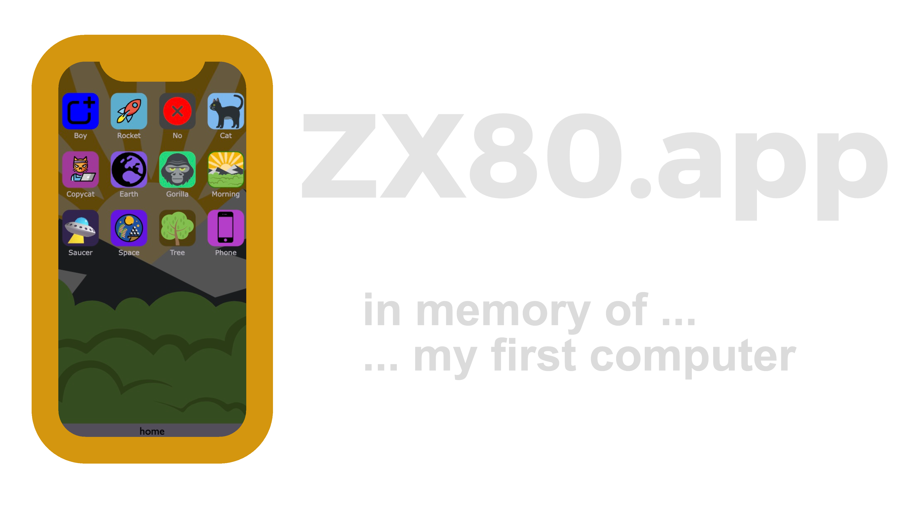

  

# zx80.app, the online programmable computer

WARNING : this app is at its very early stage of development... less than ALPHA !

It looks like a smartphone home-screen, and (will) allow the use, (simplified) development, and (easy) share of webapps.

Although this app works online, it is also designed to be installed locally (it is a PWA). It will be then available offline like a 'classic' app ! (see how at the end of this page)

For the installation process, use :
- iPod/iPhone/iPad : Apple Safari
- OSX, Windows, Linux : Google Chrome (or Microsoft Edge)

# how to install zx80.app on any platform ?

Here is [a link for some more info on how to install a PWA webapp](https://www.cdc.gov/niosh/mining/content/hearingloss/installPWA.html#:~:text=If%20the%20site%20is%20a,the%20%22three%20dot%22%20menu.)