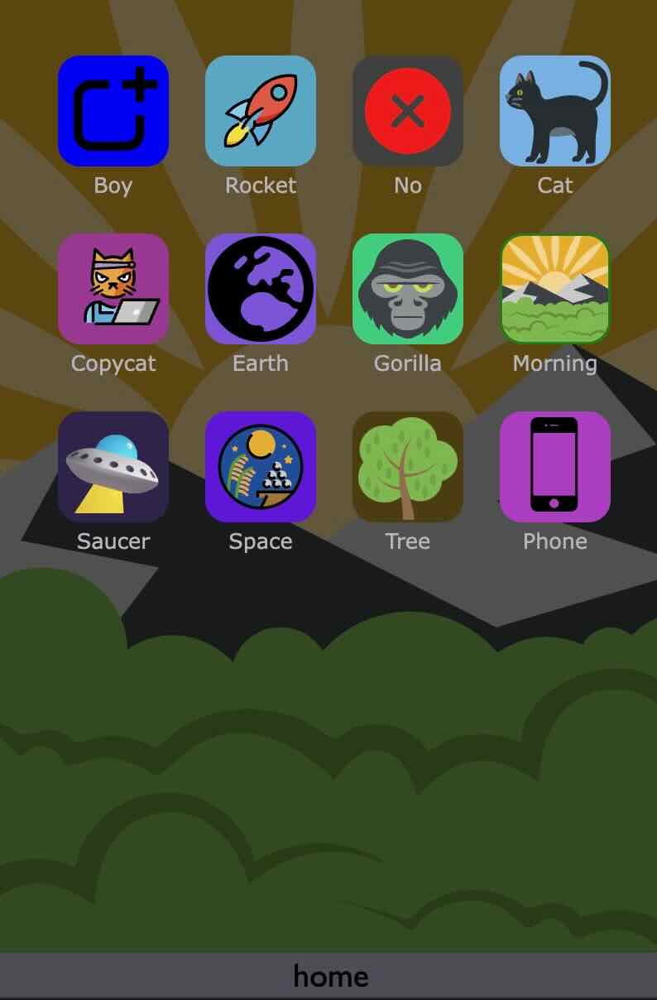

  

# bibi-os, the personnal online (and installable) programmable computer

This is a very early ALPHA version of an online computer... 
...installable as a PWA on OSX, iOS, android, linux, windows etc... with :
- Safari for iOS
- Chrome or microsoft Edge for osx, windows, linux...

It looks like a smarphone home screen, can play, edit and share webapp

# how to install a PWA on any system ?

Here is [a link for some more info on how to install a PWA](https://www.cdc.gov/niosh/mining/content/hearingloss/installPWA.html#:~:text=If%20the%20site%20is%20a,the%20%22three%20dot%22%20menu.)